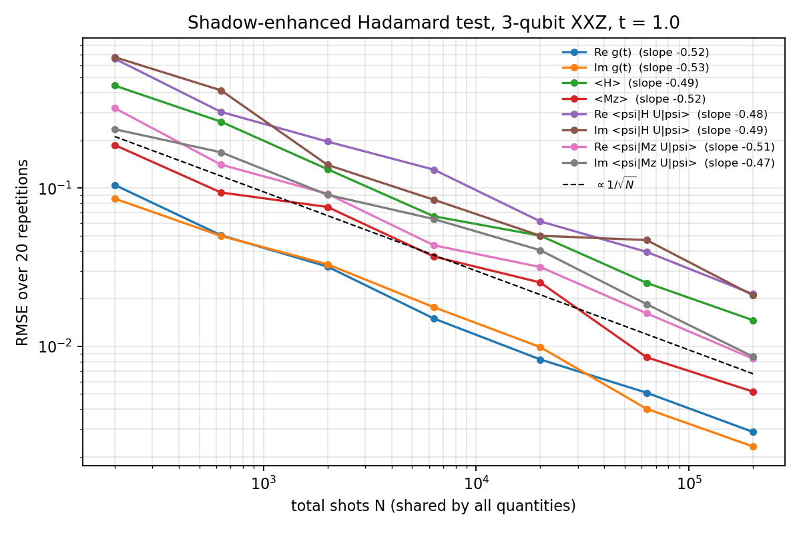
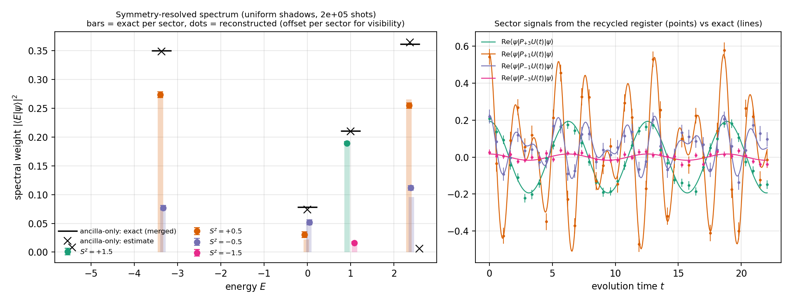
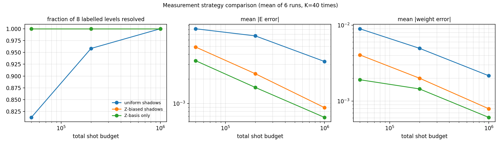
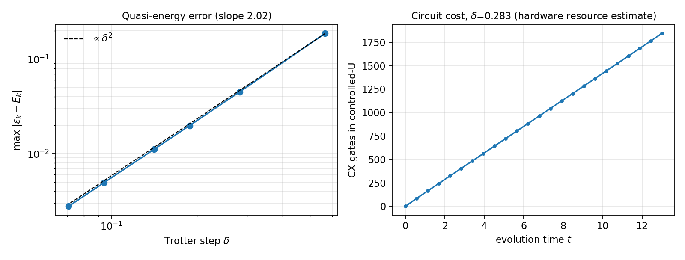
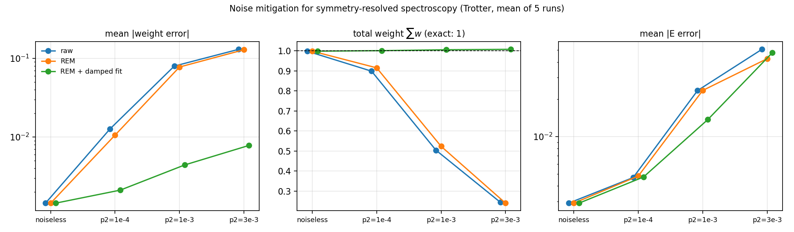

# From Garbage to Spectra: Shadow-Enhanced Hadamard Testing

以 Qiskit 實作並驗證 Faehrmann, Eisert, Kueng, *PRL* **135**, 150603 (2025)
的 shadow-enhanced Hadamard test，做出三量子位元 XXZ 模型的 **symmetry-resolved spectral analyzer**，
並延伸到閘層級電路、雜訊緩解與 IBM 真機。

**重點結果**

- **基礎題**：同一批 2×10⁵ shots 同時估出 Hadamard 訊號、能量、守恆量與兩個 ancilla–系統聯合量，
  8 個量全部落在精確值 1.4σ 內，誤差隨 shots 以 1/√N 下降。
- **進階題**：8 個被佔據能階的**能量、權重、S^z 標籤全部重建**，包括傳統 Hadamard test 分不開的對稱簡併能階。
  偏向 Z 的量測策略在 5×10⁴ shots 就 8/8。
- **雜訊**：閘雜訊使訊號隨時間衰減；以 damped fit 把權重外推回 t = 0，權重誤差降低 6–17 倍。
- **IBM 真機（ibm_kingston）**：t = 1.0 時 Hadamard 訊號被同調誤差破壞，
  但從「垃圾」暫存器免費拿到的守恆量 ⟨M_z⟩ 仍然準確（0.859 ± 0.014，精確 0.863）。

---

## 這個專案在做什麼

### 1. Hadamard test：用一顆輔助 qubit 聽系統的「泛音」

```
ancilla : |0⟩ ─H──●──H── 量測 → s = ±1
                  │
系統    : |ψ⟩ ────U(t)──── （傳統做法：直接丟掉）
```

U(t) = e^{−iHt} 只在 ancilla 為 |1⟩ 時作用。重複量 ancilla，平均值給出

**g(t) = ⟨ψ|e^{−iHt}|ψ⟩ = Σₖ |cₖ|² e^{−iEₖt}**

在一串時間點量 g(t) 再做頻譜分析：峰的位置是能階 Eₖ，峰的高度是初始態在該能階的權重 |cₖ|²。
系統暫存器在這個過程中從頭到尾沒被看過 —— 論文稱它為 garbage。

### 2. Classical shadows：隨機基底量測，事後估任何觀測量

每個 qubit 隨機選 X / Y / Z 基底量測，每次得到一張模糊的「快照」；
用正確的反演公式平均很多張，就能估幾乎任何觀測量（Huang, Kueng, Preskill 2020）。
代價是變異數：一個作用在 k 個 qubit 上的 Pauli 字串約需 3ᵏ 倍的 shots。

### 3. 結合：系統不丟，改做 shadow 量測

每個 shot 同時得到 ancilla 的 s 與系統快照 ô，**同一批資料**給出三種東西：

| 怎麼平均 | 得到 | 意義 |
|---|---|---|
| E_X[s] + i E_Y[s] | g(t) = ⟨ψ\|U\|ψ⟩ | 原本的 Hadamard 訊號，一點沒少 |
| E_X[s·ô] + i E_Y[s·ô] | ⟨ψ\|O U\|ψ⟩ | **ancilla–系統聯合量**，傳統做法拿不到 |
| E[ô]（忽略 s） | ½(⟨O⟩_ψ + ⟨O⟩_{Uψ}) | 若 [O, H] = 0，**就是 ⟨O⟩_ψ**：能量與守恆量免費拿到 |

### 4. 對稱解析頻譜

H 與總磁化 M_z = Σ Zᵢ 對易，每個能階都帶 S^z 標籤。把聯合量裡的 O 換成 sector 投影 P_m：

**g_m(t) = ⟨ψ|P_m U(t)|ψ⟩ = Σ_{k∈sector m} |cₖ|² e^{−iEₖt}**，且 Σ_m g_m = g

一條混了 8 個能階的訊號拆成 4 條，每條只含同一個對稱的能階：
每個峰**天生帶標籤**，不同對稱但能量相同的能階也能分開。

---

## 推導

系統 = qubit 0..n−1，ancilla = qubit n。控制演化之後 |Φ⟩ = (|0⟩|ψ⟩ + |1⟩U|ψ⟩)/√2。
ancilla 量到 s 之後系統的（未歸一化）條件態 ρ̃_s：

| ancilla 基底 | ρ̃₊ − ρ̃₋ | ρ̃₊ + ρ̃₋ |
|---|---|---|
| X | ½(Uρ + ρU†) | ½(ρ + UρU†) |
| Y（先 S†） | (i/2)(ρU† − Uρ) | ½(ρ + UρU†) |

對系統觀測量 O 取跡：Tr[O(ρ̃₊ − ρ̃₋)] 在 X 基底給 Re⟨ψ|OU|ψ⟩、在 Y 基底給 Im⟨ψ|OU|ψ⟩；
Tr[O(ρ̃₊ + ρ̃₋)] 給 ½(⟨O⟩_ψ + ⟨O⟩_{Uψ})。O = 1 即退回原本的 Hadamard test。
classical shadow 的 ô 是 O 的無偏估計，所以上表三列都是無偏估計量（`tests/` 以精確機率驗證到 1e−10）。

---

## 模型

**H = J Σᵢ (XᵢXᵢ₊₁ + YᵢYᵢ₊₁ + Δ ZᵢZᵢ₊₁) + h Σᵢ Zᵢ**，3 個 qubit，開放邊界。

題目說「supplied three-qubit XXZ model」，但原論文沒有數值範例、課程也沒提供參數，
所以自己選並寫明理由，再用第二組檢驗分析器不是只對一組有效：

| 組 | 參數 | 為什麼 |
|---|---|---|
| **A（主要）** | J = 1, Δ = 0.5, h = 0 | \|Δ\| < 1 是 XXZ 最一般的區域；Δ ≠ 1 避開 Heisenberg 點額外的 SU(2) 簡併。h = 0 保留自旋翻轉對稱 → **±S^z 能階兩兩簡併**，最能展示對稱解析 |
| **B（檢驗）** | J = 1, Δ = 0.5, h = 0.3 | 磁場打破簡併，8 個能階全部不同，且有跨 sector 的近鄰能階（1.900 vs 2.072） |

輸入態 ⊗ Rz(φᵢ)Ry(θᵢ)|0⟩，θ = (1.1, 2.0, 0.6)、φ = (0.3, −0.8, 1.2)：容易製備，且與每個 sector 都有重疊。
所有參數都可從命令列換（`--J --delta --h --periodic`）。

---

## 結果

### 1. 基礎題 —— 同一批 shots，八個量

t = 1.0，2×10⁵ shots（X、Y ancilla 基底各半），uniform shadows，精確受控演化：

| 量 | 估計 ± 1σ | 精確 | z |
|---|---|---|---|
| Re g(t) | −0.4098 ± 0.0029 | −0.4083 | −0.55 |
| Im g(t) | −0.5109 ± 0.0027 | −0.5085 | −0.88 |
| ⟨H⟩（免費） | −0.118 ± 0.015 | −0.112 | −0.41 |
| ⟨M_z⟩（免費） | 0.8634 ± 0.0063 | 0.8628 | +0.09 |
| Re ⟨ψ\|H U\|ψ⟩（聯合） | 0.644 ± 0.021 | 0.647 | −0.14 |
| Im ⟨ψ\|H U\|ψ⟩（聯合） | −0.491 ± 0.021 | −0.504 | +0.60 |
| Re ⟨ψ\|M_z U\|ψ⟩（聯合） | −0.063 ± 0.009 | −0.058 | −0.55 |
| Im ⟨ψ\|M_z U\|ψ⟩（聯合） | −0.622 ± 0.009 | −0.609 | −1.39 |



20 次重複的 RMSE 對總 shots 的 log-log 斜率 −0.47 ~ −0.53（理想 −0.5）。

### 2. 進階題 —— 對稱解析頻譜

**A 組**（K = 40 個時間點、取樣間隔 dt = 0.565）：8 個被佔據能階，但只有 4 個相異能量。
只看 ancilla 只得到 4 個合併峰、沒有標籤；回收系統暫存器後 8 個能階全部重建：



**量測策略比較**（同預算下 6 次重複平均）：

| 策略 | 預算 | 解出能階比例 | 平均 \|ΔE\| | 平均 \|Δw\| | 假峰 |
|---|---|---|---|---|---|
| uniform shadows | 5×10⁴ | 0.81 | 0.0082 | 0.0090 | 0 |
| | 2×10⁵ | 0.96 | 0.0067 | 0.0050 | 0 |
| | 10⁶ | 1.00 | 0.0033 | 0.0022 | 0 |
| Z-biased（0.15 / 0.15 / 0.70） | 5×10⁴ | 1.00 | 0.0049 | 0.0041 | 0 |
| | 2×10⁵ | 1.00 | 0.0023 | 0.0020 | 0 |
| | 10⁶ | 1.00 | 0.0009 | 0.0008 | 0 |
| Z-basis only | 5×10⁴ | 1.00 | 0.0033 | 0.0019 | 0 |
| | 2×10⁵ | 1.00 | 0.0016 | 0.0014 | 0 |
| | 10⁶ | 1.00 | 0.0007 | 0.0006 | 0 |



sector 投影全是 Z 字串，所以偏向 Z 的量測變異數小得多。**取捨**：只量 Z 頻譜最準，
但估不出 ⟨H⟩（需要 X、Y 基底）；Z-biased 頻譜幾乎一樣好，同時保留完整的 shadow 資訊。
能量也能從頻譜自洽得到：Σ wₖEₖ 與精確 ⟨H⟩ 差約 0.005–0.02。

**B 組**（h = 0.3，`results/*_h03*`）：Z-biased 與 Z-only 在 5×10⁴ 與 2×10⁵ shots 都 8/8、零假峰
（Z-biased 2×10⁵：|ΔE| 0.0035、|Δw| 0.0018）；uniform 在 2×10⁵ 也 8/8。
只看 ancilla 在這裡也分得開 1.900 / 2.072 —— matrix pencil 在高訊雜比下能超過傅立葉解析度 2π/T，
所以只看 ancilla 真正缺的是**標籤**，不是解析度。

### 3. 閘層級電路與雜訊緩解

**Trotter 電路。** 受控演化拆成 H / S / RZ / CX：每個 Pauli 項做「基底轉換 → parity ladder →
CRZ(2θ) = RZ–CX–RZ–CX → 還原」，二階 Trotter。測試確認整個電路**逐元素等於**受控 Trotter 么正（含相對相位）。

- 所有取樣時間用**同一個步長 δ**，訊號因此是 Trotter 步的 Floquet quasi-energy 的精確指數和，
  Trotter 誤差能和 shot / 閘雜訊分開。
- 同一個 bond 的 XX、YY、ZZ 互相對易且排在一起，**每一步都精確守恆 M_z**：對稱標籤在 Trotter 化後仍是精確的。
- quasi-energy 誤差 ∝ δ²（實測斜率 2.02）。δ = 0.283 時誤差 0.045，代價是 t = 13 時已有 1844 個 CX ——
  **長時間頻譜在真硬體上受電路深度限制**。



**雜訊模型**：單 qubit 閘去極化 p₁、CX 去極化 p₂、讀出翻轉 p_ro（density-matrix 模擬）。
**緩解**：(1) 讀出錯誤校正（REM：全 0 / 全 1 校正電路求每個 qubit 的混淆矩陣再取逆）；
(2) **damped fit**：閘雜訊讓訊號隨深度（∝ t）指數衰減，每個 sector 擬合
g_m(t) = Σ w e^{−iEt} e^{−γ|t|} 並回報 t = 0 的權重，等於把雜訊外推到零；能量不受純衰減影響。

Trotter δ = 0.283、K = 24、只量 Z、2×10⁵ shots、5 次平均（對照 = Trotter quasi-energy 頻譜）：

| p₂ | 方法 | 解出比例 | \|ΔE\| | \|Δw\| | Σw（應為 1） | 假峰 |
|---|---|---|---|---|---|---|
| 0 | — | 1.00 | 0.0029 | 0.0014 | 0.998 | 0 |
| 1e−4 | raw | 1.00 | 0.0047 | 0.0127 | 0.899 | 0 |
| | REM + damped | 1.00 | 0.0047 | **0.0021** | **1.001** | 0 |
| 1e−3 | raw | 0.88 | 0.0236 | 0.0798 | 0.504 | 1.0 |
| | REM | 0.88 | 0.0236 | 0.0776 | 0.524 | 1.0 |
| | REM + damped | **1.00** | 0.0137 | **0.0044** | **1.006** | **0** |
| 3e−3 | raw | 0.68 | 0.0508 | 0.1302 | 0.245 | 2.4 |
| | REM + damped | 0.93 | 0.0476 | **0.0078** | **1.008** | 0.4 |



- **REM 單獨幾乎沒用**：主要損失是閘雜訊造成的衰減，不是讀出錯誤。
- **damped fit 把權重誤差壓低 6–17 倍、Σw 拉回 1**；p₂ = 1e−3 時 8 個能階全部救回、假峰歸零。
- 單一時間點只能做 REM（t = 1、164 個 CX、p₂ = 1e−3：Re g −0.340 → −0.346，參考 −0.417）——
  **閘雜訊的偏差在單點上修不掉**，多時間點的頻譜分析才有資訊把衰減估出來。

### 4. IBM 真機（ibm_kingston）

job `daut44qhcrkc73e09m3g`，Trotter δ = 0.25，uniform shadows，每個時間點 X / Y 各 2×10⁴ shots，
共 110 個電路、9.6×10⁴ shots（含讀出校正），實體 qubit [52, 53, 39, 54]。參考值 = 無雜訊 Trotter 精確值。

| t | 量 | 參考 | 原始 | 讀出校正 |
|---|---|---|---|---|
| 0.5（80 個雙 qubit 閘） | Re g | 0.361 | 0.243 ± 0.007 | **0.339 ± 0.007** |
| | Im g | −0.082 | −0.055 ± 0.007 | −0.013 ± 0.007 |
| | ⟨H⟩（免費） | −0.112 | −0.055 ± 0.033 | −0.074 ± 0.033 |
| | ⟨M_z⟩（免費） | 0.863 | 0.906 ± 0.014 | 0.890 ± 0.014 |
| | Re ⟨ψ\|M_z U\|ψ⟩（聯合） | 0.479 | 0.360 ± 0.021 | **0.471 ± 0.021** |
| 1.0（156 個雙 qubit 閘） | Re g | −0.417 | −0.143 ± 0.007 | −0.117 ± 0.007 |
| | Im g | −0.496 | −0.392 ± 0.007 | −0.410 ± 0.006 |
| | ⟨H⟩（免費） | −0.112 | −0.011 ± 0.032 | −0.013 ± 0.032 |
| | ⟨M_z⟩（免費） | 0.863 | 0.871 ± 0.014 | **0.859 ± 0.014** |
| | Re ⟨ψ\|M_z U\|ψ⟩（聯合） | −0.057 | −0.028 ± 0.021 | 0.011 ± 0.021 |

- **t = 0.5**：讀出校正之後 Re g 與聯合量回到參考值附近，這一點上主要損失是讀出錯誤。
- **t = 1.0**：Hadamard 訊號本身壞了 —— |g| 從 0.648 掉到約 0.43，**相位也轉了**，
  是同調誤差而不是單純衰減，讀出校正修不掉。
- **免費拿到的守恆量反而最穩**：⟨M_z⟩ 只用系統暫存器的邊際分布、不需要 ancilla 的相干性，
  而 M_z 在每個 Trotter 步都守恆。**即使 Hadamard 訊號被雜訊吃掉，回收的暫存器仍給出可靠的物理量 ——
  這就是「把 garbage 拿來用」的實際價值。**
- ⟨H⟩ 含 X / Y 基底的項，變異數大也對閘雜訊敏感，t = 1.0 偏約 3σ。

---

## 怎麼確認做對了

- **無偏性**：`mode="exact"` 以精確機率取代取樣（等於無限 shots），所有估計量與解析值差 < 1e−10，
  uniform 與 biased 兩種量測都驗。
- **誤差棒誠實度**：40 次獨立重複的 z² 平均 ≈ 1。這個測試是為了一個真的發生過的 bug 加的：
  **Aer SamplerV2 在同一次呼叫裡讓不同電路共用亂數流**，使 27 個量測設定的 ancilla 結果幾乎相同，
  變異數被低估約 √27 倍（一度偏 7σ）。修法是每個電路各自設 seed。
- **Trotter 電路**：Operator 逐元素等於受控 Trotter 么正；每一步與 M_z 對易；quasi-energy 誤差二階收斂。
- **緩解**：已知混淆矩陣下讀出校正精確還原；damped fit 在合成資料上還原能量、權重與衰減率。

```bash
python -m pytest -q    # 14 passed
```

---

## 程式結構與執行

```
shadow_hadamard/
  model.py       XXZ Hamiltonian、M_z、sector 投影、輸入態、精確參考值
  experiment.py  電路、(biased) Pauli shadow 估計器、Aer 取樣、誤差棒
  spectral.py    頻譜分析：Hermitian 延拓 + matrix pencil + NNLS + 非線性精修；damped=True 做雜訊外推
  trotter.py     閘層級受控二階 Trotter 演化、quasi-energy 參考值
  noise.py       去極化 + 讀出雜訊模型、讀出錯誤校正
scripts/
  run_fundamental.py   基礎題：驗證表 + shots 收斂                 ~1 min
  run_advanced.py      進階題：對稱解析頻譜 + 量測策略比較          數分鐘（--J --delta --h --periodic --tag）
  run_noise.py         Trotter 誤差與成本、雜訊掃描、雜訊緩解         ~3 min
  run_hardware.py      IBM 真機（需先 QiskitRuntimeService.save_account）
tests/                 無偏性、誤差棒、Trotter、緩解
results/               圖、JSON、log
```

```bash
pip install qiskit qiskit-aer numpy scipy matplotlib pytest   # 真機另需 qiskit-ibm-runtime
python -m pytest -q
python -m scripts.run_fundamental
python -m scripts.run_advanced
python -m scripts.run_advanced --h 0.3 --tag _h03
python -m scripts.run_noise
python -m scripts.run_hardware --backend ibm_kingston
```

## 實作細節

- **Biased classical shadows**：每個 qubit 以機率 (p_X, p_Y, p_Z) 選基底，Pauli 字串估計器
  ∏_{i∈supp} [bᵢ = Pᵢ] sᵢ / p_{Pᵢ}；(1/3, 1/3, 1/3) 即 Huang–Kueng–Preskill 原版。
  量不到的觀測量（例如只量 Z 時的 XX）回報 NaN，而不是給一個錯的數。
- **頻譜分析**：
  1. g_m(−t) = conj g_m(t) → 資料長度免費加倍；
  2. Nyquist：|E| ≤ Σ|係數|，取 dt = 0.9π / Σ|係數| 避免混疊；
  3. matrix pencil 的模型階數 = sector 維度（對稱性給的上界）；
  4. 權重必為非負實數 → NNLS，再對 (E, w) 聯合非線性最小平方；
  5. 權重小於 3σ（σ 由擬合殘差估）的峰視為雜訊丟棄。
- **真機的 layout**：每個 (t, ancilla 基底) 的主體電路只 transpile 一次，再以原生 rz / sx 接上隨機量測基底，
  所有隨機設定讀同一組實體 qubit，讀出校正才對得上。

## 限制

- 3 個 qubit：shadow 的優勢（觀測量數量多、qubit 多時仍可用）在這個規模看不出來，這裡驗證的是正確性與流程。
- 精確受控演化（第 1、2 節）是 16×16 矩陣，不是硬體可執行的電路；閘層級版本見第 3、4 節。
- 雜訊模型是去極化 + 讀出的簡化版，真機上還有同調誤差與串擾（第 4 節 t = 1.0 就是例子）。
- 真機只跑短時間點；完整頻譜所需深度（上千個 CX）超出目前硬體。

## 參考文獻

1. P. K. Faehrmann, J. Eisert, R. Kueng, *In the shadow of the Hadamard test: Using the garbage state for good and further modifications*, Phys. Rev. Lett. **135**, 150603 (2025). arXiv:2505.15913
2. H.-Y. Huang, R. Kueng, J. Preskill, *Predicting many properties of a quantum system from very few measurements*, Nat. Phys. **16**, 1050 (2020)
3. L. Lin, Y. Tong, *Heisenberg-limited ground-state energy estimation for early fault-tolerant quantum computers*, PRX Quantum **3**, 010318 (2022)
4. K. Klymko *et al.*, *Real-time evolution for ultracompact Hamiltonian eigenstates on quantum hardware*, PRX Quantum **3**, 020323 (2022)
